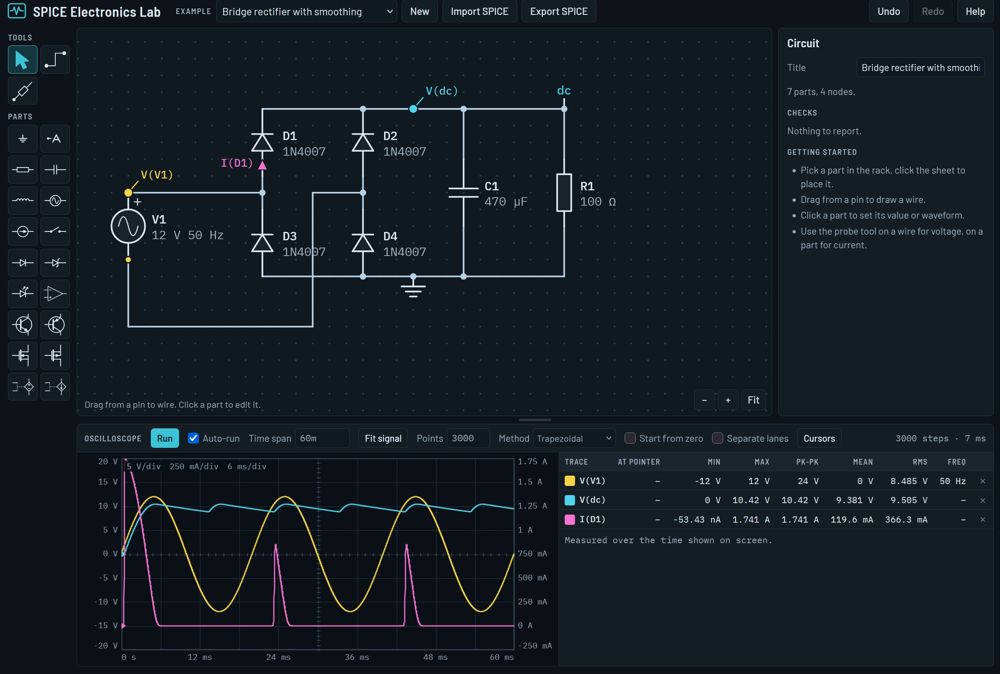

# SPICE Electronics Lab

An electronics bench in a single web page. Draw a circuit, drive it with a signal generator, probe any
node voltage or part current on an oscilloscope, and read or write SPICE netlists.

There is nothing to install or build. Open `SPICE_Electronics_Lab.html` in a browser, or put the file on
any web server. Everything runs in the browser; no data leaves the page.

## What it does

**Schematic editor**

- Parts: resistor, capacitor, inductor, voltage and current sources, switch, diode, zener, LED, NPN and
  PNP transistors, N and P channel MOSFETs, op-amp, voltage-controlled voltage and current sources,
  ground and net labels.
- Place parts from the rack, drag from a pin to wire, drag parts to move them (wires follow), rotate,
  mirror, duplicate, undo and redo. Pan by dragging the sheet, zoom with the wheel.
- Values accept engineering notation: `4.7k`, `100n`, `2.2u`, `1M`, `1meg`.

**Signal generator**

Every source can be DC, sine, square (block), triangle (zigzag), sawtooth, pulse, exponential, AM, FM,
noise or a piecewise-linear shape typed in as time/value points. A small preview shows the waveform
over the simulated time span.

**Oscilloscope**

- Probe tool: click a wire or pin for that node's voltage, click a part for the current through it.
  On a transistor, click near the pin whose current you want. "Voltage across" gives the difference
  between the two pins of a part.
- Voltages on the left axis, currents on the right, or one lane per trace for signals of very
  different size.
- Per trace: value at the pointer, minimum, maximum, peak-to-peak, mean, RMS and frequency, measured
  over the time shown on screen. Two cursors give time and value differences.
- Scroll to zoom in time, drag to pan, double-click to see the whole run.

**SPICE import and export**

- Export writes a standard netlist. The drawing is stored in comment lines starting with `*@`, which
  other simulators ignore, so an exported file comes back exactly as drawn.
- Import reads R, C, L, V, I, D, Q, M, E, G and X elements, `.model`, `.subckt` (expanded), `.param`
  with plain numbers, `.tran`, and the sources DC, SIN, PULSE, PWL, EXP, SFFM and AM. A netlist without
  layout comments is drawn as a ladder: one vertical rail per node, parts in a column beside it.
- Elements that are not supported (coupled inductors, transmission lines, behavioural sources,
  current-controlled sources) are skipped and listed after import.
- Square, triangle and sawtooth are written as PULSE, noise as PWL, and the op-amp as a small
  subcircuit of standard parts. In SPICE files `M` means milli and `MEG` means mega; the lab reads and
  writes files that way, while its own value fields treat a capital `M` as mega.

## Keyboard

| Key | Action |
| --- | --- |
| `W` | Wire tool |
| `P` | Probe tool |
| `Esc` | Back to select, end a wire |
| `R` | Rotate the selection or the part being placed |
| `X`, `Y` | Mirror horizontally, vertically |
| `Del` | Delete the selection |
| `Ctrl`+`D` | Duplicate |
| `Ctrl`+`Z`, `Ctrl`+`Y` | Undo, redo |
| `Ctrl`+`A` | Select all |
| `Shift`+drag | Select an area; `Shift`+click places several parts in a row |

## How it simulates

Transient analysis by modified nodal analysis: a DC operating point (Newton iteration, with gmin
stepping, source stepping and a settle-from-zero fallback), then time steps with the trapezoidal rule
or Backward Euler and Newton iteration at every step. Steps land on the corners of every source
waveform. Fast positive-feedback switching (Schmitt triggers, multivibrators, latches) is detected and
followed with extra small steps.

Device models:

- Diode: Shockley equation with reverse breakdown and a constant junction capacitance.
- Bipolar transistor: Ebers-Moll transport model with constant junction capacitances.
- MOSFET: level 1 square law with channel-length modulation and constant gate capacitances; the bulk
  is tied to the source.
- Op-amp: finite gain, one pole set by the gain-bandwidth product, output held between two limits.

## Limits

- Only transient analysis. No AC sweep, DC sweep or noise analysis.
- The semiconductor models leave out series resistance, charge storage, the Early effect and
  temperature. The part presets (1N4148, 2N3904, 2N7000 and others) use typical published parameter
  values and are not manufacturer models.
- The time step is fixed by the number of points, refined only where the solver needs it. There is no
  error-controlled step size as in a full SPICE.
- Results agree with analytic solutions for RC, RLC and LC circuits. The exported netlists have not
  yet been cross-checked by running them in ngspice or LTspice.
- The AM source exists in ngspice but not in LTspice.

## Relation to SPICE

This is an independent implementation written from the published methods. It contains no code from
Berkeley SPICE, ngspice or any other simulator; it only reads and writes the SPICE netlist format.

The page loads the Barlow and IBM Plex Mono typefaces from Google Fonts when online and falls back to
system fonts otherwise.

## Licence

Copyright (C) 2026 Jurgen Kobierczynski

This program is free software: you can redistribute it and/or modify it under the terms of the GNU
General Public License as published by the Free Software Foundation, version 3. It is distributed in
the hope that it will be useful, but WITHOUT ANY WARRANTY; without even the implied warranty of
MERCHANTABILITY or FITNESS FOR A PARTICULAR PURPOSE. See [LICENSE](LICENSE) for the full text.

Developed with Claude (Anthropic).
